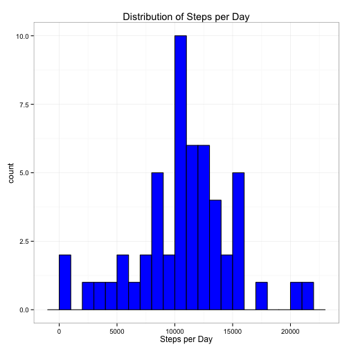
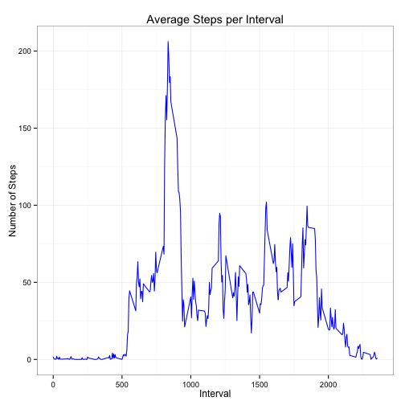
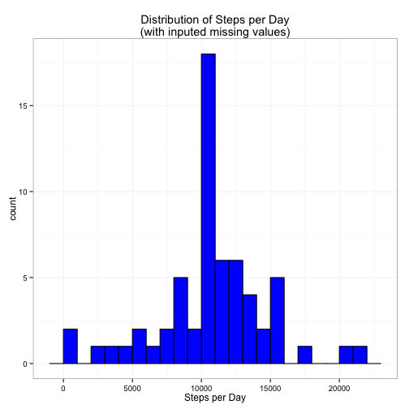
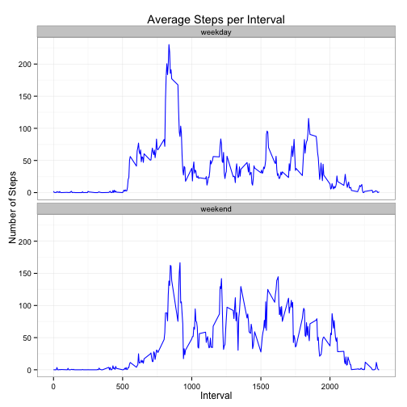

---
---
title: "Reproducible Research: Peer Assessment 1"
output: 
  html_document:
    keep_md: true
---

# Reproducible Research: Peer Assessment 1

This assignment makes use of data from a personal activity monitoring device. This device collects data at 5 minute intervals through out the day. The data consists of two months of data from an anonymous individual collected during the months of October and November, 2012 and include the number of steps taken in 5 minute intervals each day.

## Loading and preprocessing the data

The activity data is loaded from a CSV-formatted file: 'activity.csv', with the columns:

* steps: Number of steps taking in a 5-minute interval (missing values are coded as NA)
* date: The date on which the measurement was taken in YYYY-MM-DD format
* interval: Identifier for the 5-minute interval in which measurement was taken

Read the data. Make use of the dplyr and ggplot2 libraries in all the following.


```r
require(dplyr)
require(ggplot2)

activity <- read.csv('activity.csv')
```

## What is mean total number of steps taken per day?

To calculate the mean and median number of steps per day, we group the activity data by date, and then summarize the grouped data with the sum function.


```r
stepsd <- activity %>% group_by(date) %>% summarize(sum=sum(steps))

g <- ggplot(stepsd,aes(sum)) +
    geom_histogram(binwidth=1000,color='black',fill='blue') +
    theme_bw() +
    labs(title='Distribution of Steps per Day') +
    labs(x='Steps per Day')
print(g)
```

 

Compute the mean number of steps per day,


```r
mean1 <- mean(stepsd$sum,na.rm=T)
mean1
```

```
## [1] 10766.19
```

and the median number of steps per day.


```r
median1 <- median(stepsd$sum,na.rm=T)
median1
```

```
## [1] 10765
```

## What is the average daily activity pattern?

To calculate the average pattern of steps per 5-minute interval, group the data by the interval column and then summarize with the mean function (and remove NA values). The plot's x-axis is interval number but more properly, the interval should be converted to a continuous time of day, because the interval value has jumps at 55,100; 155,200; etc ...; this can be seen if a point plot is made rather than a line.


```r
stepsi <- activity %>% group_by(interval) %>% summarize(mean=mean(steps,na.rm=TRUE))

g <- ggplot(stepsi,aes(interval,mean)) +
    geom_line(color='blue') +
    theme_bw() +
    labs(title='Average Steps per Interval') +
    labs(x='Interval') +
    labs(y='Number of Steps')
print(g)
```

 


```r
maxint <- stepsi$interval[stepsi$mean==max(stepsi$mean)]
```

The maximum number of average steps taken occurs at interval 835.


## Imputing missing values

There are number of date/interval entries that have missing values, coded as NA.


```r
nentry <- length(activity$steps)
nmissing <- sum(is.na(activity$steps))
```

The number of missing values is 2304, out of 17568 entries.

Create a new activity dataset and replace missing values, with the mean value over all days at the corresponding interval. Then summarize the new dataset by day as before and show the histogram of steps per day.


```r
activity2 <- activity
for (i in seq(length(stepsi$interval))) {
    int <- stepsi$interval[i]
    intmean <- floor(stepsi$mean[i])
    index <- which(activity2$interval == int & is.na(activity2$steps))
    activity2$steps[index] <- intmean
    }

stepsd2 <- activity2 %>% group_by(date) %>% summarize(sum=sum(steps))

g <- ggplot(stepsd2,aes(sum)) +
    geom_histogram(binwidth=1000,color='black',fill='blue') +
    theme_bw() +
    labs(title='Distribution of Steps per Day\n(with inputed missing values)') +
    labs(x='Steps per Day')
print(g)
```

 

Compute the mean number of steps per day,


```r
mean2 <- mean(stepsd2$sum)
mean2
```

```
## [1] 10749.77
```

and the median number of steps per day.


```r
median2 <- median(stepsd2$sum)
median2
```

```
## [1] 10641
```

The computed mean and median values of the daily number of steps changes compared to when the missing values of the original data are replaced, by the mean valued per the corresponding interval. In the original date, the mean and median are 10766.2 and 10765, compared to 10749.8 and 10641 respectively,  when computed from the data with inputed values.


## Are there differences in activity patterns between weekdays and weekends?

Modify the dataset with filled-in values with a new column evaluating to either 'weekday' or 'weekend' depending on the day of the week. Plot the mean per interval, comparing weekday vs. weekend.


```r
activity2 <- activity2 %>%
    mutate(workday=ifelse(weekdays(as.Date(date)) %in% c('Saturday','Sunday'),'weekend','weekday'))

stepsi2 <- activity2 %>% group_by(interval,workday) %>% summarize(mean=mean(steps))

g <- ggplot(stepsi2,aes(interval,mean)) +
    facet_wrap(~workday,ncol=1) +
    geom_line(color='blue') +
    theme_bw() +
    labs(title='Average Steps per Interval') +
    labs(x='Interval') +
    labs(y='Number of Steps')
print(g)
```

 

On weekdays, there is more activity in the morning between 0500 and 1000 hours, and slightly less in the early afternoon, compared to weekend days.
